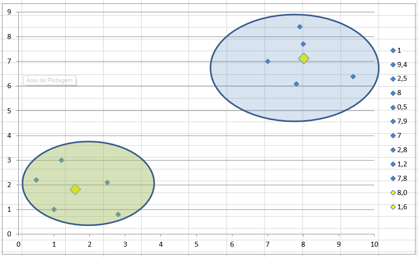

<h1 align="center">
  Kmeans
</h1>

## 📚 Projeto

Algoritmo desenvolvido para a disciplina de Inteligência Artificial da Uni7. O algoritmo receberá coordenadas como pontos do grafo, e vai selecionar 2 pontos aleatoriamente dos pontos criados anteriormente para serem os centroides. O objetivo é separar os pontos em dois grupos, onde cada pontos pertencerá ao seu centroide mais próximo.

## 💼 Tecnologias utilizadas

Para o desenvolvimento deste site utilizei as seguintes tecnologias:

- Python;
- Random Lib;

## 🔧 Arquitetura

Para o desenvolvimento do algoritmo utilizei 3 classes como estrutura de dados, a classe Pontos, a classe Cluster (centroide), e a classe Kmeans. A classe Pontos armazena os pontos fornecidos pelo usuário, o Cluster tem seu Id, suas coordenadas e uma lista de pontos que ele armazena. A classe KMeans é responsável pela execução do algoritmo. Como seu construtor, é passado a quantidade de centroides que iremos ter. Ela armazena uma lista de objetos dos pontos e clusters, e possui métodos para calcular a distância dos pontos para os clusters, e também para recalcular as coordenadas dos clusters.
